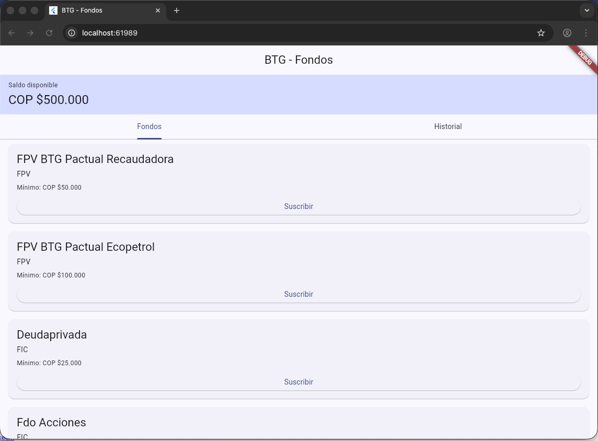
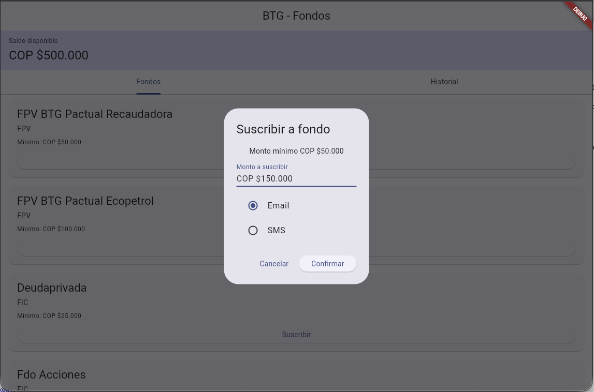
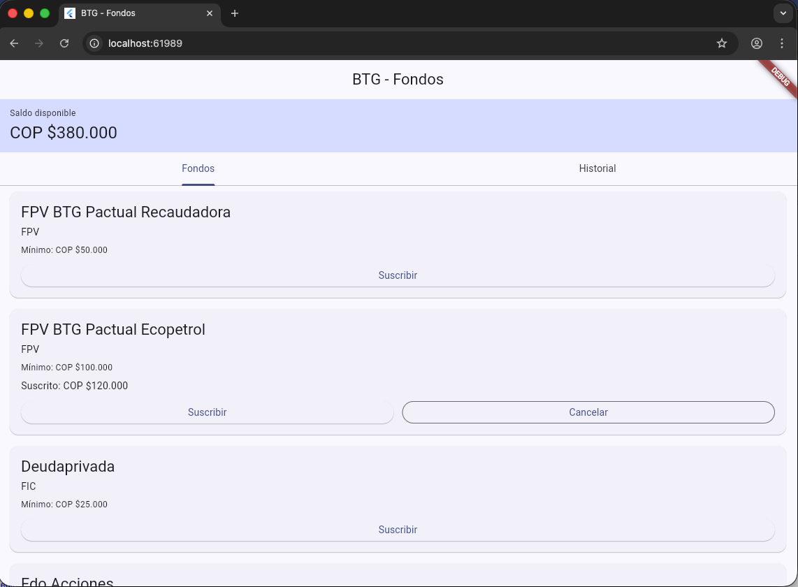
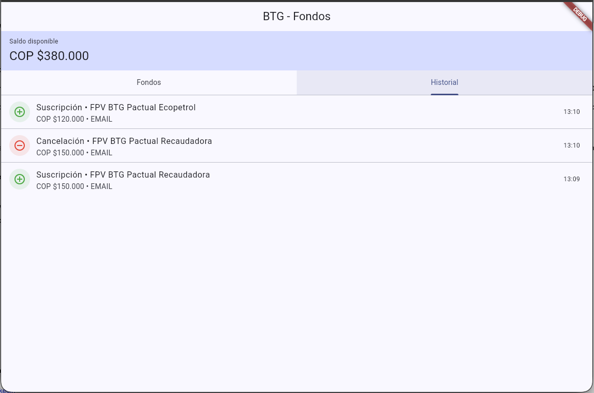

# Proyecto Ceiba

Una aplicación de Flutter para gestionar suscripciones a fondos, permitiendo a los usuarios suscribirse a fondos de inversión, ver transacciones y gestionar su saldo.

## Características

- Ver fondos de inversión disponibles
- Suscribirse a fondos con validación de monto mínimo
- Cancelar suscripciones
- Ver historial de transacciones
- Almacenamiento persistente de datos usando SharedPreferences

## Capturas de pantalla

### Pantalla principal



### Diálogo de suscripción



### Fondo con datos



### Historial de compras



## Prerrequisitos

Antes de comenzar, asegúrate de tener Flutter instalado en tu máquina. Sigue la guía oficial de instalación de Flutter para tu plataforma:

### Instalar Flutter

1. **Descargar Flutter SDK**:
   - Visita el [sitio web de Flutter](https://flutter.dev/docs/get-started/install) y descarga la última versión estable para tu sistema operativo (Windows, macOS o Linux).

2. **Extraer y Configurar**:
   - Extrae el archivo descargado a una ubicación deseada (por ejemplo, `C:\flutter` en Windows o `/opt/flutter` en macOS/Linux).
   - Agrega el directorio bin de Flutter a la variable PATH de tu sistema:
     - En macOS/Linux: Agrega `export PATH="$PATH:/ruta/a/flutter/bin"` a tu perfil de shell (por ejemplo, `~/.bashrc` o `~/.zshrc`).
     - En Windows: Agrega la ruta a las Variables de Entorno.

3. **Verificar Instalación**:
   - Abre una terminal/símbolo del sistema y ejecuta:
     ```bash
     flutter doctor
     ```
   - Este comando verifica tu entorno y muestra un informe. Asegúrate de que todos los componentes estén configurados correctamente (por ejemplo, Android Studio, Xcode para iOS).

4. **Configurar IDE**:
   - Instala un IDE como Visual Studio Code o Android Studio.
   - Para VS Code, instala las extensiones de Flutter y Dart.

Para instrucciones detalladas, consulta la [Guía de Instalación de Flutter](https://flutter.dev/docs/get-started/install).

## Instalación

1. **Clonar el Repositorio**:
   ```bash
   git clone https://github.com/tu-usuario/ceiba_project.git
   cd ceiba_project
   ```

2. **Instalar Dependencias**:
   ```bash
   flutter pub get
   ```

3. **Ejecutar Pruebas** (Opcional, para asegurar que todo funcione):
   ```bash
   flutter test
   ```

## Ejecutar la Aplicación

### En un Dispositivo/Emulador Conectado

1. **Iniciar un Emulador o Conectar un Dispositivo**:
   - Para Android: Abre Android Studio, crea un AVD o conecta un dispositivo físico.
   - Para iOS (solo macOS): Abre Xcode y configura un simulador.

2. **Ejecutar la Aplicación**:
   ```bash
   flutter run
   ```

   Esto construirá y lanzará la aplicación en el dispositivo o emulador conectado.

### En Web (Opcional)

Si deseas ejecutar en la web:

1. Habilita el soporte web (si no está habilitado):
   ```bash
   flutter config --enable-web
   ```

2. Ejecuta en web:
   ```bash
   flutter run -d chrome
   ```

## Estructura del Proyecto

- `lib/`: Código principal de la aplicación
  - `core/`: Utilidades compartidas, enums, servicios
  - `features/funds/`: Características relacionadas con fondos (datos, dominio, presentación)
- `test/`: Pruebas unitarias
- `android/`, `ios/`, `web/`: Código específico de la plataforma

## Contribuyendo

1. Haz un fork del repositorio.
2. Crea una rama de características.
3. Haz tus cambios y agrega pruebas.
4. Ejecuta `flutter test` para asegurar que las pruebas pasen.
5. Envía una solicitud de pull.

## Licencia

Este proyecto está licenciado bajo la Licencia MIT - consulta el archivo [LICENSE](LICENSE) para más detalles.
